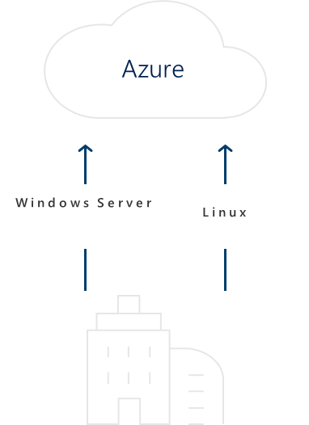
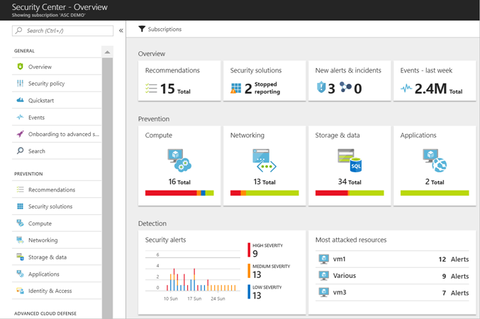
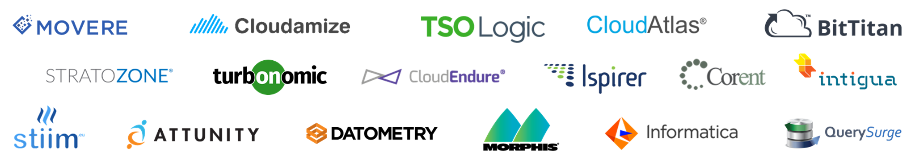
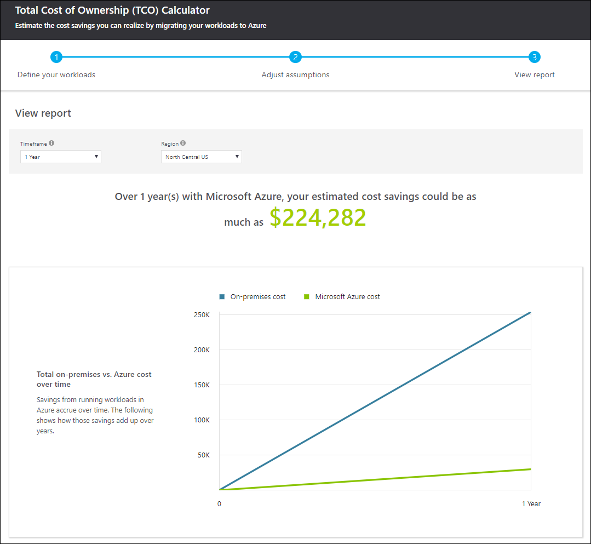

Windows Server and SQL Server 2008/R2 end of support planning

Whiteboard design session trainer guide

September 2018

Information in this document, including URL and other Internet Web site references, is subject to change without notice. Unless otherwise noted, the example companies, organizations, products, domain names, e-mail addresses, logos, people, places, and events depicted herein are fictitious, and no association with any real company, organization, product, domain name, e-mail address, logo, person, place or event is intended or should be inferred. Complying with all applicable copyright laws is the responsibility of the user. Without limiting the rights under copyright, no part of this document may be reproduced, stored in or introduced into a retrieval system, or transmitted in any form or by any means (electronic, mechanical, photocopying, recording, or otherwise), or for any purpose, without the express written permission of Microsoft Corporation.

Microsoft may have patents, patent applications, trademarks, copyrights, or other intellectual property rights covering subject matter in this document. Except as expressly provided in any written license agreement from Microsoft, the furnishing of this document does not give you any license to these patents, trademarks, copyrights, or other intellectual property.

The names of manufacturers, products, or URLs are provided for informational purposes only and Microsoft makes no representations and warranties, either expressed, implied, or statutory, regarding these manufacturers or the use of the products with any Microsoft technologies. The inclusion of a manufacturer or product does not imply endorsement of Microsoft of the manufacturer or product. Links may be provided to third party sites. Such sites are not under the control of Microsoft and Microsoft is not responsible for the contents of any linked site or any link contained in a linked site, or any changes or updates to such sites. Microsoft is not responsible for webcasting or any other form of transmission received from any linked site. Microsoft is providing these links to you only as a convenience, and the inclusion of any link does not imply endorsement of Microsoft of the site or the products contained therein.

© 2018 Microsoft Corporation. All rights reserved.

Microsoft and the trademarks listed at <https://www.microsoft.com/en-us/legal/intellectualproperty/Trademarks/Usage/General.aspx> are trademarks of the Microsoft group of companies. All other trademarks are property of their respective owners.

**Contents**

<!-- TOC -->

- [Trainer information](#trainer-information)
  - [Role of the trainer](#role-of-the-trainer)
  - [Whiteboard design session flow](#whiteboard-design-session-flow)
  - [Before the whiteboard design session: How to prepare](#before-the-whiteboard-design-session-how-to-prepare)
  - [During the whiteboard design session: Tips for an effective whiteboard design session](#during-the-whiteboard-design-session-tips-for-an-effective-whiteboard-design-session)
- [Windows Server 2008 and SQL Server 2008 end of support planning whiteboard design session student guide](#windows-server-2008-and-sql-server-2008-end-of-support-planning-whiteboard-design-session-student-guide)
  - [Abstract and learning objectives](#abstract-and-learning-objectives)
  - [Step 1: Review the customer case study](#step-1-review-the-customer-case-study)
    - [Customer situation](#customer-situation)
    - [Customer needs](#customer-needs)
    - [Customer objections](#customer-objections)
    - [Infographic for common scenarios](#infographic-for-common-scenarios)
  - [Step 2: Design a proof of concept solution](#step-2-design-a-proof-of-concept-solution)
  - [Step 3: Present the solution](#step-3-present-the-solution)
  - [Wrap-up](#wrap-up)
  - [Additional references](#additional-references)
- [Windows Server and SQL Server 2008/2008 R2 end of support planning whiteboard design session trainer guide](#windows-server-and-sql-server-20082008-r2-end-of-support-planning-whiteboard-design-session-trainer-guide)
  - [Step 1: Review the customer case study](#step-1-review-the-customer-case-study-1)
  - [Step 2: Design a proof of concept solution](#step-2-design-a-proof-of-concept-solution-1)
  - [Step 3: Present the solution](#step-3-present-the-solution-1)
  - [Wrap-up](#wrap-up-1)
  - [Preferred target audience](#preferred-target-audience)
  - [Preferred solution](#preferred-solution)
  - [Checklist of preferred objection handling](#checklist-of-preferred-objection-handling)
  - [Customer quote (to be read back to the attendees at the end)](#customer-quote-to-be-read-back-to-the-attendees-at-the-end)

<!-- /TOC -->

# Trainer information

Thank you for taking time to support the whiteboard design sessions as a trainer!

## Role of the trainer

An amazing trainer:

-   Creates a safe environment in which learning can take place.

-   Stimulates the participant's thinking.

-   Involves the participant in the learning process.

-   Manages the learning process (on time, on topic, and adjusting to benefit participants).

-   Ensures individual participant accountability.

-   Ties it all together for the participant.

-   Provides insight and experience to the learning process.

-   Effectively leads the whiteboard design session discussion.

-   Monitors quality and appropriateness of participant deliverables.

-   Effectively leads the feedback process.

## Whiteboard design session flow 

Each whiteboard design session uses the following flow:

**Step 1: Review the customer case study (15 minutes)**

**Outcome**

Analyze your customer's needs.

-   Customer's background, situation, needs and technical requirements

-   Current customer infrastructure and architecture

-   Potential issues, objectives and blockers

**Step 2: Design a proof of concept solution (60 minutes)**

**Outcome**

Design a solution and prepare to present the solution to the target customer audience in a 15-minute chalk-talk format.

-   Determine your target customer audience.

-   Determine customer's business needs to address your solution.

-   Design and diagram your solution.

-   Prepare to present your solution.

**Step 3: Present the solution (30 minutes)**

**Outcome**

Present solution to your customer:

-   Present solution

-   Respond to customer objections

-   Receive feedback

**Wrap-up (15 minutes)**

-   Review preferred solution

## Before the whiteboard design session: How to prepare

Before conducting your first whiteboard design session:

-   Read the Student guide (including the case study) and Trainer guide.

-   Become familiar with all key points and activities.

-   Plan the point you want to stress, which questions you want to drive, transitions, and be ready to answer questions.

-   Prior to the whiteboard design session, discuss the case study to pick up more ideas.

-   Make notes for later.

## During the whiteboard design session: Tips for an effective whiteboard design session

**Refer to the Trainer guide** to stay on track and observe the timings.

**Do not expect to memorize every detail** of the whiteboard design session.

When participants are doing activities, you can **look ahead to refresh your memory**.

-   **Adjust activity and whiteboard design session pace** as needed to allow time for presenting, feedback, and sharing.

-   **Add examples, points, and stories** from your own experience. Think about stories you can share that help you make your points clearly and effectively.

-   **Consider creating a "parking lot"** to record issues or questions raised that are outside the scope of the whiteboard design session or can be answered later. Decide how you will address these issues, so you can acknowledge them without being derailed by them.

***Have fun**! Encourage participants to have fun and share!*

**Involve your participants.** Talk and share your knowledge but always involve your participants, even while you are the one speaking.

**Ask questions** and get them to share to fully involve your group in the learning process.

**Ask first**, whenever possible. Before launching into a topic, learn your audience's opinions about it and experiences with it. Asking first enables you to assess their level of knowledge and experience, and leaves them more open to what you are presenting.

**Wait for responses**. If you ask a question such as, "What's your experience with (fill in the blank)?" then wait. Do not be afraid of a little silence. If you leap into the silence, your participants will feel you are not serious about involving them and will become passive. Give participants a chance to think, and if no one answers, patiently ask again. You will usually get a response.

# Windows Server 2008 and SQL Server 2008 end of support planning whiteboard design session student guide

## Abstract and learning objectives

Many customers have huge on-premises footprints of Windows Server and SQL Server 2008 and 2008 R2, but these products are rapidly approaching End of Support (EOS). This session is designed to help customers understand the risks of running unsupported software and presents great options for using EOS to modernize in Azure or on-premises.

In this whiteboard design session, you will work with a group to look at the process of migrating workloads to Azure.

At the end of this whiteboard design session, you will leave with the information needed to develop a solid migration plan to keep mission-critical apps and data protected as they are transitioned and modernized. Topics covered will include how to get an inventory of a 2008 server environment, how to categorize 2008 workloads and evaluate the best option for each category, migration and upgrade tools available, TCO analysis tools, offers available from Microsoft to leverage existing licenses and innovations of recent product updates, licensing and technologies.     

## Step 1: Review the customer case study 

**Outcome** 

Analyze your customer’s needs.

Timeframe: 15 minutes

Directions: With all participants in the session, the facilitator/SME presents an overview of the customer case study along with technical tips.

1.  Meet your table participants and trainer.

2.  Read all of the directions for steps 1-3 in the student guide.

3.  As a table team, review the following customer case study.

### Customer situation

Fabrikam is an automotive parts manufacturer based in the United States. They are an OEM manufacturer of parts for commercial vehicles. They have manufacturing plants throughout the US and Mexico. Fabrikam competes globally with other manufacturers for contracts, this highly competitive environment makes Fabrikam very price sensitive.

"We are preparing for Windows and SQL Server 2008/R2 end of support and would like to better understand our options for upgrade and migration." Sloane Peterson, Fabrikam CIO

Fabrikam does not have a complete company-wide inventory of the number of servers and applications running on legacy software and many of the systems are undocumented and not well understood by IT staff. They want to understand their current workloads and they would like to take advantage of the cloud where appropriate.

Fabrikam currently has many legacy applications that are running on Windows Server 2008 including a line of business inventory management system that also leverages SQL Server 2008. The inventory management system is considered a mission critical application. It is highly complex and is leveraged by various parts of the business with many upstream and downstream dependencies. Some of these dependencies are Linux systems. Because many of these systems are critical to the business, they need to understand the business continuity and disaster recovery options when upgrading in place or migrating to the cloud.

The Inventory Management system is one of the most critical systems at Fabrikam. It was originally architected when the company was much smaller. It currently runs on Windows Server 2008 R2 with a separate SQL Server 2008 backend. The application team that supports it would ultimately like to rearchitect the system for better scalability and to take better advantage of new innovations in inventory tracking. They see cloud technologies as a good fit for this type of application, but they lack the experience, expertise and time to rebuild the application right now.

They would like a short-term plan to maintain support of the system while the application team reskills and gains experience in Azure.
They would also like a long-term plan to take advantage of the new advancements in SQL Server while still getting the most out of their Azure investment by minimizing the administrative overhead.

"We would love to take advantage of the cloud to minimize the administrative overhead of the Inventory Management System, we simply cannot get all of the dependencies sorted out before the official end of support." Frances Bradley, Manager Inventory Applications

### Customer needs 

1.  Identify migration and upgrade tools to help in assessing, migrating and optimizing the current environment.

2.  Fabrikam needs to build an inventory of their current systems and provide some organization around the various systems they have in place. The inventory should include dependencies and tiering of the applications to help in prioritizing application upgrades and migrations.

3.  Fabrikam has a large mix of applications including Microsoft, third-party and custom applications. They need to evaluate the upgrade options for each workload.

4.  They would like to modernize applications and take advantage of the cloud where it makes sense. How should they go about identifying suitable applications and the costs of running them in Azure?

5.  Applications that are not moving to Azure will need to be optimized on-premises.

6.  As part of the analysis, Fabrikam would like to better understand how to analyze cost of a solution that is slated to be migrated to Azure. They have chosen an application solution that represents a fairly common pattern in their environment and would like you to provide total cost of ownership analysis of this solution in Azure.

### Customer objections 

1.  We have some third-party applications where we do not have complete control of the code or schema. We will not be able to upgrade these applications before the end of support. What options do we have for these applications?

2.  We have hundreds of applications that are running on servers that are nearing end of support. Some are virtual machines running on VMWare, some are older physical machines. Does Microsoft have any tools to help us identify these applications?

3.  We need to minimize the amount of downtime during migration. How will we do this? What kind of downtime are we looking at?

4.  When migrating workloads into Azure, how do we handle security and authentication? Will my workloads continue to use the same authentication that was used on-premises?

5.  Some of our data has very strict regulatory constraints and cannot leave the country/region of origin, how do we handle this type of data in Azure? Will data be replicated or located in other countries or regions? 

6.  How will migrating from SQL Server to Azure SQL Database impact the role of our database administration team?

### Infographic for common scenarios

**Azure Migrate**

**Azure Database Migration Service**

**Azure Security Center**

**Cost Management for Azure**

## Step 2: Design a proof of concept solution

**Outcome**

Design a solution and prepare to present the solution to the target customer audience in a 15-minute chalk-talk format.

Timeframe: 60 minutes

**Business needs**

Directions:  With all participants at your table, answer the following questions and list the answers on a flip chart:

1.  Who should you present this solution to? Who is your target customer audience? Who are the decision makers?

2.  What customer business needs do you need to address with your solution?

**Design**

Directions: With all participants at your table, respond to the following questions on a flip chart:

_Assess - Plan for end of support_

- **Inventory**: Fabrikam needs to build an inventory of their current systems. Determine what needs to be tracked in this inventory. What information would you track in your inventory to help Fabrikam organize and prioritize systems for their end of support planning? How would you prioritize systems?

- **Tools:** Identify any tools that Fabrikam might use to help with assessments, migrations and optimizations of their Windows Server and SQL Server systems. You should identify which stage of the process you would leverage these tools and what value they provide.

- **Cost Analysis:** Fabrikam currently has Software Assurance. Provide a cost analysis of the following options available to Fabrikam:

    a. Maintain current version

    b. Rehost - Migrate to cloud

    Additionally, provide a one-year total cost of ownership analysis for migrating the following example solution to Azure. The details below represent a common pattern seen in Fabrikam's environment. Provide analysis for migrating this solution from Fabrikam's Michigan datacenter to the North Central US region of Azure. You can use state averages for utility rates, you may accept the defaults for information that is not provided below.

    |    |            |            |
    |----------|-------------|-------------|
    | Web Farm |  |
    |  | Workload: | Windows Server |
    |  | Environment: | Virtual |
    |  | Operating System: | Windows Server 2008 R2 |
    |  | VMs: | 4 |
    |  | Virtualization: | VMWare |
    |  | Cores (per VM): | 4 |
    |  | RAM (GB): | 16 |
    |  | Optimize by: | CPU |
    | Process Server |  |
    |  | Workload: | Windows Server |
    |  | Environment: | Virtual |
    |  | Operating System: | Windows Server 2008 R2 |
    |  | VMs: | 1 |
    |  | Virtualization: | VMWare |
    |  | Cores (per VM): | 4 |
    |  | RAM (GB): | 16 |
    |  | Optimize by: | CPU |
    | Database Server |  |
    |  | *Source server specs* |  |
    |  | Database: | Microsoft SQL Server |
    |  | License: | Enterprise |
    |  | Environment: | Physical server |
    |  | Operating System: | Windows Server 2008 R2 |
    |  | Servers: | 1 |
    |  | Procs per server: | 2 |
    |  | Cores (per proc): | 8 |
    |  | RAM (GB): | 128 |
    |  | Optimize by: | CPU |
    |  | *Destination server* |  |
    |  | Service: | SQL Database Managed Instance |
    |  | Managed instance tier: | General purpose |
    |  | Managed instance cores: | 2 |
    |  | SQL Server storage: | 500 GB |
    |  | SQL Server backup: | 1 TB |
    | Adjust assumptions |  |
    |  | Azure Hybrid Benefit: | On |
    |  | Software Assurance coverage: | On |
    |  | Geo-redundant storage: | Off |
    |  | Virtual Machine costs: | On |

_Migrate - Upgrade in place or migrate to Azure_

-  **Migration strategy:** Fabrikam would like to take full advantage of the cloud. They would like to create a multifaceted application strategy to determine how applications will be migrated to Azure. You need to identify the various paths to moving applications to the cloud and when each path provides the highest value.

-  **Windows Server Upgrades and Migrations**: Detailed migration steps:

    a. How will physical machines be migrated to Azure?

    b. How will machines hosted in VMWare be migrated to Azure?

    c. Some IIS based web sites will be migrated to Azure Web Apps. Document the requirements and the process for migrating to Azure Web Apps. 

-  **SQL Server Upgrades and Migrations**: Provide Fabrikam with detailed migration steps. At a minimum, your steps should cover the following scenarios:

    a. How SQL Servers that will be migrated to Azure virtual machines be migrated?

    b. How SQL databases that will be migrated to Azure SQL Database and Azure SQL Database Managed Instances be migrated? 

-  **Diagram the solution**

_Optimize_

-  **Security and Authentication:** How will Active Directory be managed in the cloud? Will we continue to do things the way we have in the past?

-  **Cost management:** With the ease of deploying and scaling services in the cloud we are concerned about cost management. What tools can we leverage to help us with cost management?

-  **Compliance:** We want to make sure that our cloud resources are properly secured so that we can maintain compliance. How do we monitor security and maintain compliance in the cloud? What about systems that remain on-premises?

-  **SQL Database Management:** What type of database administration tasks can we automate in Azure SQL Database? We are looking to minimize the amount of administrative tasks our DBAs are doing and focus them on higher value tasks.

**Prepare**

Directions: With all participants at your table:

1.  Identify any customer needs that are not addressed with the proposed solution.

2.  Identify the benefits of your solution.

3.  Determine how you will respond to the customer's objections.

Prepare a 15-minute chalk-talk style presentation to the customer.

## Step 3: Present the solution

**Outcome**

Present a solution to the target customer audience in a 15-minute chalk-talk format.

Timeframe: 30 minutes

**Presentation**

Directions:

1.  Pair with another table.

2.  One table is the Microsoft team and the other table is the customer.

3.  The Microsoft team presents their proposed solution to the customer.

4.  The customer makes one of the objections from the list of objections.

5.  The Microsoft team responds to the objection.

6.  The customer team gives feedback to the Microsoft team.

7.  Tables switch roles and repeat Steps 2-6.

##  Wrap-up 

Timeframe: 15 minutes

Directions: Tables reconvene with the larger group to hear the facilitator/SME share the preferred solution for the case study.

##  Additional references
|    |            |
|----------|:-------------:|
| **Description** | **Links** |
| Azure Migration Center  | <https://azure.microsoft.com/en-us/migration/>  |
| Azure Hybrid Benefit  | <https://azure.microsoft.com/en-us/pricing/hybrid-benefit/>  |
| Azure Migrate  | <https://docs.microsoft.com/en-us/azure/migrate/migrate-overview>   |
| Azure Pricing Calculator  | <https://azure.microsoft.com/en-us/pricing/calculator/>  |
| Azure TCO Calculator  | <https://azure.microsoft.com/en-us/pricing/tco/calculator/>  |
| Azure Site Recovery | <https://docs.microsoft.com/en-us/azure/site-recovery/>    |
| Database Migration Guide   | <https://datamigration.microsoft.com/>      |
| Windows Server Migration Guide   | <https://go.microsoft.com/fwlink/?linkid=872689>      |
| Azure Database Migration Service   | <https://docs.microsoft.com/en-us/azure/dms/dms-overview>      |
| Data Migration Assistant   | <https://docs.microsoft.com/en-us/sql/dma/dma-overview?view=sql-server-2017>      |
| Database Experimentation Assistant   | https://blogs.msdn.microsoft.com/datamigration/2018/08/06/release-database-experimentation-assistant-dea-v2-6/      |
| Azure Cost Management   | <https://docs.microsoft.com/en-us/azure/cost-management/overview>   |

# Windows Server and SQL Server 2008/2008 R2 end of support planning whiteboard design session trainer guide

## Step 1: Review the customer case study

-   Check in with your table participants to introduce yourself as the trainer.

-   Ask, "What questions do you have about the customer case study?"

-   Briefly review the steps and timeframes of the whiteboard design session.

-   Ready, set, go! Let the table participants begin.

## Step 2: Design a proof of concept solution

-   Check in with your tables to ensure that they are transitioning from step to step on time.

-   Provide some feedback on their responses to the business needs and design.

    -   Try asking questions first that will lead the participants to discover the answers on their own.

-   Provide feedback for their responses to the customer's objections.

    -   Try asking questions first that will lead the participants to discover the answers on their own.

## Step 3: Present the solution

-   Determine which table will be paired with your table before Step 3 begins.

-   For the first round, assign one table as the presenting team and the other table as the customer.

-   Have the presenting team present their solution to the customer team.

    -   Have the customer team provide one objection for the presenting team to respond to.

    -   The presentation, objections, and feedback should take no longer than 15 minutes.

    -   If needed, the trainer may also provide feedback.

## Wrap-up

-   Have the table participants reconvene with the larger session group to hear the facilitator/SME share the following preferred solution.

##  Preferred target audience

-   Frances Bradley, Manager of Data Warehousing

-   Jude Watkins, Director of Customer Analytics

-   Sloane Peterson, Vice President of Store Operations

## Preferred solution

The solution for Fabrikam's scenario follows the process:

1.  Assess - In this phase you will use automated migration tools to provide insight into your environment. It can be broken into the three steps:

    - Discovery: In the discovery phase you will collect information about your various workloads. At the end of this phase you should have an inventory of all of your servers.
    - Mapping: Identify dependencies between servers. Group servers logically to represent applications.
    - Evaluate: Evaluate groups for compatibility and cost. Select a migration strategy based on application requirements and migration objectives.

2.  Migrate

3.  Optimize

_Assess - Plan for end of support_

- **Inventory**: Fabrikam needs to build an inventory of their current systems. Determine what needs to be tracked in this inventory. What information would you track in your inventory to help Fabrikam organize and prioritize systems for their end of support planning? How would you prioritize systems?

    **Answer:** Inventory data should include server metadata and performance metrics about your applications. At the end of this step, you’ll have a complete inventory of servers with metadata for each including any dependencies with other applications allowing you to build a cloud migration plan. 
    
    When assigning priority, there are a couple factors to consider. If your organization is relatively new to cloud it is best to start with smaller, less complex applications to gain experience and confidence. This also allows you to work out any process or governance issues that you may have overlooked.

- **Tools:** Identify any tools that Fabrikam might use to help with assessments, migrations and optimizations of their Windows Server and SQL Server systems.

    **Answer:** There are several critical tools available to Fabrikam to assist with environment assessment. There are also multiple facets to assessing an environment.

    - **Azure Migrate**: Use Azure Migrate to assess known windows instances. Currently, the Azure Migrate service only supports discovery of machines hosted in VMWare, physical and Hyper-V hosted machines are coming soon. 

    - **Microsoft Assessment and Planning Toolkit**: The MAP Toolkit provides agentless discovery and inventory of computers and applications, hardware and software migration readiness assessments, software usage tracking, and capacity planning for virtualization, public and private cloud migration.

    - **Database Migration Guide**: The Database Migration Guide creates a custom report on how to migrate your source data to the destination of your choice: on-premises, cloud, private cloud, IaaS or PaaS.

    - **Azure Database Migration Service**: Use the Azure Database Migration service to analyze existing on premises databases and migrate them to Azure SQL Database or Azure SQL Databases Managed Instances. 

    - **Data Migration Assistant**: Data Migration Assistant (DMA) enables you to upgrade to a modern data platform by detecting compatibility issues that can impact database functionality on your new version of SQL Server. It recommends performance and reliability improvements for your target environment. It allows you to not only move your schema and data, but also uncontained objects from your source server to your target server.

    - **Database Experimentation Assistant**: Database Experimentation Assistant (DEA) is an A/B testing solution for SQL Server upgrades. It will assist in evaluating a targeted version of SQL Server for a given workload. Customers who are upgrading from previous SQL Server versions (SQL Server 2005 and above) to any new version of the SQL Server will be able to use these analysis metrics.

    - **Migration Partners**: There are a variety of migration partners to assist with migration. Managed Service Providers can help you drive migration initiatives and manage your resources once they're in Azure. Systems integrators can help you drive migration initiatives by providing project management and technical consulting. A complete list of partners can be found at the Azure Migration Center web page: https://azure.microsoft.com/migration. 

        

- **Cost/Benefit Analysis:** Fabrikam currently has Software Assurance. Provide a high-level cost/benefit analysis of the following options available to Fabrikam:

    - Maintain current version

    - Rehost - Migrate to cloud

    **Answer:** Fabrikam has several options they can take advantage of depending on the strategy they choose for each application workload. 

    - If they are not in a position to upgrade a given system immediately, they can purchase Extended Security Updates. Extended Security Updates allows you to purchase up to 3 years of additional security updates for Windows Server and SQL Server 2008 and 2008 R2.  

    - Rehosting to Azure give you the flexibility and scalability of the cloud. Fabrikam can take advantage of Azure Hybrid Benefits for Windows and SQL when migrating to Azure. Additionally, migrating your virtual machines to Azure virtual machines will get you 3 more years of Extended Security Updates for Windows Server and SQL Server 2008/R2 at no additional charge.

    For Windows Server, Azure Hybrid Benefit saves Fabrikam the OS costs when migrating to an Azure Virtual Machine and an additional 3 years of Extended Security Updates. 

        2-proc license = 16 cores

    When migrating databases to Azure SQL Database Fabrikam can also take advantage of Azure Hybrid Benefit. If Fabrikam opts to migrate to an Azure Virtual Machine they can take advantage of the 3 years of Extended Security Updates.
        
        Standard Edition license = 1x General Purpose vCore
        Enterprise Edition license = 4x General Purpose vCore

    For those that cannot migrate to Azure there is also an option to purchase Extended Security Updates. 

    To estimate cost savings, Fabrikam should use the Azure TCO Calculator. The below example uses the information provided, the current Michigan average electricity rates and migration to the North Central US Azure region. Your results may be different as Azure pricing and electrcity rates change.

    

_Migrate - Upgrade in place or migrate to Azure_

-  **Migration strategy:** Fabrikam would like to take full advantage of the cloud. They would like to create a multifaceted application strategy to determine how applications will be migrated to Azure. You need to identify the various paths to moving applications to the cloud and when each path provides the highest value.

    **Answer:** There are four cloud migration strategies, rehost, refactor, rearchitect and rebuild.

    - **Rehost**: This strategy is often referred to as "lift and shift" migration, this no-code option lets you migrate your existing applications to Azure quickly. Each application is migrated as-is, which provides the benefits of the cloud without the risks or costs of making code changes.

        - Use cases:
            - You need to move applications from your datacenter to the cloud quickly.
            - Your apps are architected to leverage Azure IaaS scalability.
            - Your business requires the applications but doesn’t need to change their capabilities right away.
            - Your applications or database requirements can only be met using an Azure IaaS VM.
            - You need to move the application with no code changes.

    - **Refactor**: Refactoring, often referred to as "repackaging," is a cloud migration approach that lets you minimally alter application code or apply configuration changes necessary to connect the application to Azure PaaS and take better advantage of the cloud. For example, you can move your existing apps to Azure App Service or Azure Kubernetes Service (AKS). You can also refactor your relational and non-relational databases into Azure SQL Database Managed Instance, Azure Database for MySQL, Azure Database for PostgreSQL, and Azure Cosmos DB.

        - Use cases:
            - You need to use an existing code base and development skills, and code portability is a concern.
            - Your application can be easily repackaged to work in Azure.
            - You want to apply innovative DevOps practices provided by Azure.
            - Your IT team is investing in DevOps using a container strategy for certain workloads.

    - **Rearchitect**: Modify or extend an existing application's code base to optimize the application architecture for cloud scale. For example, decompose a monolithic application into microservices that work together and readily scale. And rearchitect your relational and non-relational databases to Azure fully-managed DBaaS solutions, like Azure SQL Database Managed Instance, Azure Database for MySQL, Azure Database for PostgreSQL, and Azure Cosmos DB.

        - Use cases:
            - Your application needs a major revision to incorporate new capabilities or to work more effectively on a cloud platform.
            - You want to make use of existing application investments.
            - You want to meet scalability requirements in a cost-effective way.
            - You want to minimize use of virtual machines.
            - You want to apply innovative DevOps practices provided by Azure.

    - **Rebuild**: Rebuild an application from scratch using cloud-native technologies from Azure. For example, build greenfield applications with cloud-native technologies like serverless, Azure AI, Azure SQL Database Managed Instance, Azure Cosmos DB, and others.

        - Use cases:
            - You want rapid development, and the existing application is limiting in terms of functionality and lifespan.
            - You’re ready to build new applications using cloud-native technologies.
            - You want to build innovative apps taking advantage of advancements in AI, blockchain, and IoT.
            - You want to expedite your business innovation.
            - You want to apply innovative DevOps practices provided by Azure.
    
-  **Windows Server Upgrades and Migrations**: How will physical and virtual machines be migrated to Azure?

    **Answer:** In both cases, Azure Site Recovery is the recommended tool for performing a migration to Azure virtual machines. Virtual Machines hosted in VMWare can also take advantage of the Azure Migrate tool to orchestrate the process.

    Basic steps for migrating with Azure Site Recovery:
    - Prepare Azure resources, including an Azure subscription, an Azure virtual network, and a storage account.
    - Prepare your on-premises VMware servers for migration. You verify VMware support requirements for Site Recovery, prepare VMware servers for discovery, and prepare to install the Site Recovery Mobility service on VMs that you want to migrate.
    - Set up migration. You set up a Recovery Services vault, configure source and target migration settings, set up a replication policy, and enable replication. You can run a disaster recovery drill to check that migration of a VM to Azure is working correctly.
    - Run a failover to migrate on-premises machines to Azure.

-  **SQL Server Upgrades and Migrations**: Migration steps:

    - How SQL Servers that will be migrated to Azure virtual machines be migrated?

    - How SQL databases that will be migrated to Azure SQL Database and Azure SQL Database Managed Instances be migrated?

    **Answer:** 
    All migrations from on-premises databases to Azure should take advantage of the Azure Database Migration Service. This will allow you to assess compatibility prior to the actual migration and in some cases will allow you to orchestrate the migration directly from the Database Migration Service. You should consult the Database Migration Guide for details of various database source and target combinations.
    
    - SQL Server instances that will be migrated to Azure virtual machines have numerous options for migration depending on the edition of SQL Server and the application requirements.
    
        - Use the Data Migration Assistant (DMA) to migrate the schema and data into an Azure VM.        
        - Perform an on-premises backup using compression, and then manually copy the backup file into an Azure VM.        
        - Perform a backup to URL, and then restore into an Azure VM from the URL.
        - Detach and copy the data and log files to Azure Blob storage, and then attach to an Azure VM from the URL.
        - Convert an on-premises VW to Hyper-V VHDs, upload to Azure Blob storage, and then deploy a new Azure VM using the uploaded VHD.
        - Use Azure Site Recovery to replicate the entire virtual machine to Azure.
        - Ship a hard drive using Windows Import/Export Service.
        - Use the Add Azure Replica Wizard. This option uses Always On Availability Groups to replicate your data to a replica hosted in Azure.
        - Use SQL Server transactional replication.

    To minimize downtime of your migration you should use either Always On Availability Groups or Transactional Replication. Keep in mind that neither of these options will migrate objects such as user logins and SQL Agent jobs which may need to be scripted and applied to the destination instance of SQL Server. 

    - Individual SQL databases that will by migrated to Azure SQL Database or Azure SQL Database Managed Instances should be migrated using the Azure Database Migration Service. This will allow you to assess compatibility prior to the actual migration. Note that the Azure Database Migration Service does not currently support data sync with minimal downtime cutover. 

_Optimize_

-  **Business Continuity and Disaster Recovery:** With potentially hundreds of virtual machines deployed to Azure, how do we handle backup of virtual machines in Azure? How about Azure SQL Database HADR? How are our SQL Databases protected? We have heard that backup retention is limited to 35 days, but we need to keep backups for 7 years for compliance?

    **Answer:** Azure Backup can be used to backup your Azure virtual machines and your on-premises servers. It provides encrypted, application-consistent backups stored in geo-redundant storage. Azure Backup will store backups in a Recovery Services vault located in the same region as your virtual machines.

    All SQL Databases a guaranteed 99.99% uptime for high availability. You may additionally deploy up to four asynchronous replicas into any region to support disaster recovery scenarios or scale out read workloads.

    All SQL Databases are automatically backed up. The automatic backup retention is 35 days for Standard and Premium tier databases. However, SQL Database can be configured for long term backup retention of up to 10 years. This works by copying the automated backup into an Azure Storage Account. The frequency of the copy is determined by a policy that you create.

-  **Cost management:** With the ease of deploying and scaling services in the cloud we are concerned about cost management. What tools can we leverage to help us with cost management?

    **Answer:** Azure Resource Manager policies and role-based access control provide governance to your cloud environment. You can limit the type and scale of resources deployed to Azure. You can also enforce tagging policies, the resulting tags can then be used to track things like department, project name etc.

    To manage cost in the Azure environment you can leverage Azure Cost Management. Azure Cost Management allows you to track cloud usage and expenditures for your Azure resources and other cloud providers including AWS and Google. Azure Cost Management allows you to track all of your costs based on your tagging policy. It allows for alerts for notifying you automatically when unusual spending or overspending occurs. It also allows you to improve efficiency by identifying idle virtual machines or removing unattached disks.

-  **Compliance:** We want to make sure that our cloud resources are properly secured so that we can maintain compliance. How do we monitor security and maintain compliance in the cloud? What about systems that remain on premises?

    **Answer:** Azure Resource Manager policies and role-based access control provide governance to your cloud environment. With policies you can define the types of resources that can be deployed and the regions in which they can be deployed. You can also enforce naming conventions, tag resources and other governance related operations.

    Role-based access control allows you to limit access to subscriptions, resource groups and resources.
    
    Azure Security Center provides:
    
    -  **Centralized policy management**:  Ensure compliance with company or regulatory security requirements by centrally managing security policies across all your hybrid cloud workloads.
    -  **Continuous security assessment**:  Monitor the security posture of machines, networks, storage and data services, and applications to discover potential security issues.
    -  **Actionable recommendations**:  Remediate security vulnerabilities before they can be exploited by attackers with prioritized and actionable security recommendations.
    -  **Prioritized alerts and incidents**:  Focus on the most critical threats first with prioritized security alerts and incidents.
    -  **Advanced cloud defenses**:  Reduce threats with just in time access to management ports and adaptive application controls running on your VMs.
    -  **Integrated security solutions**:  Collect, search, and analyze security data from a variety of sources, including connected partner solutions.

## Checklist of preferred objection handling

1.  We have some third-party applications where we do not have complete control of the code or schema. We will not be able to upgrade these applications before the end of support. What options do we have for these applications?

    **Potential answer:**

    Since Fabrikam has Software Assurance benefits, they are eligible to purchase Extended Security Updates for those servers that may not be upgraded due to supportability or third-party support requirements all while allowing you to maintain compliance. 

2.  We have hundreds of applications that are running on servers that are nearing end of support. Some are virtual machines running on VMWare, some are older physical machines. Does Microsoft have any tools to help us identify these applications?

    **Potential answer:**

    Microsoft provides a variety of free migration tools to assist with migration planning and execution. In addition, if the tools provided do not meet a specific need, Microsoft has a rich ecosystem of partners that provide migration tools and consulting as well.

    - **Azure Migrate**: Use Azure Migrate to assess known windows instances. Currently, the Azure Migrate service only supports discovery of machines hosted in VMWare, physical and Hyper-V hosted machines are coming soon. 

    - **Microsoft Assessment and Planning Toolkit**: The MAP Toolkit provides agentless discovery and inventory of computers and applications, hardware and software migration readiness assessments, software usage tracking, and capacity planning for virtualization, public and private cloud migration.

3.  We need to minimize the amount of downtime during migration. How will we do this? What kind of downtime are we looking at?

    **Potential answer:**

    Different systems will have different requirements when it comes to application migration. While some systems might be fine with a weekend outage, others will require minimal downtime on the order of minutes or seconds. For those systems that require minimal downtime we can leverage tools such as the Azure Database Migration Service for near-zero downtime. 

4.  When migrating workloads into Azure, how do we handle security and authentication? Will workloads continue to use the same authentication that was used on-premises? 

    **Potential answer:**

    Azure Active Directory is Microsoft's cloud-based directory and identity management service. It provides directory services, application access management and identity protection. Azure AD also supports hybrid identity with your on-premises Active Directory allowing you to synchronize on-premises directory objects while still managing your users on-premises. Synchronized identities, and optionally password hashes, enable your users to use the same password to access both on-premises and cloud-based organizational resources. For more advanced scenario requirements, such as single-sign-on (SSO) or on-premises multi-factor authentication (MFA), you need to deploy Active Directory Federation Services (AD FS) to federate identities.

5.  Some of our data has very strict regulatory constraints and cannot leave the country/region of origin, how do we handle this type of data in Azure? Will data be replicated or located in other countries or regions? 

    **Potential answer:**

    Azure has datacenters all over the world. Your data will reside in the region in which you create your resources. Any platform-provided replication, such as storage account replication, will be to the paired region which is usually in the same geography. There are exceptions to this rule though, you can see a table of all the Azure paired regions here: https://docs.microsoft.com/en-us/azure/best-practices-availability-paired-regions. 
    
6.  How will migrating from SQL Server to Azure SQL Database impact the role of our database administration team?

    **Potential answer:**
    
    Database Administrators still perform many of the tasks that are done on-premises. For example, design and configuration for high availability and disaster recovery, storage management, performance tuning of critical workloads, responding to alerts, scripting and managing database environments. The nature of how these tasks are approached will change with many of the automation and intelligent features in Azure SQL Database, allowing database administrators to focus on higher value tasks and less on the menial day-to-day tasks.

## Customer quote (to be read back to the attendees at the end)

"With Microsoft's server and database migration tools we have the building blocks we need to accelerate our cloud strategy while minimizing migration downtime and maintaining compliance."

--- Jude Watkins, Director of Database Operations, Fabrikam

